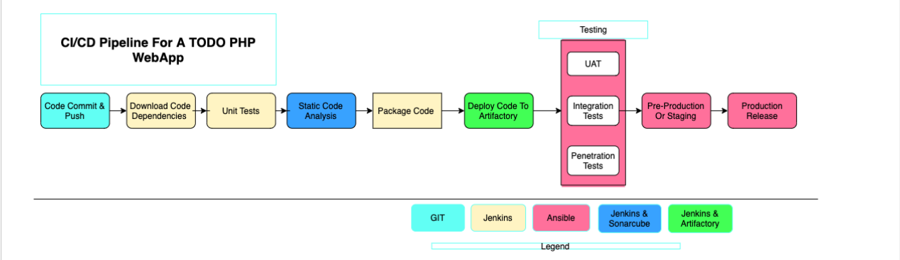
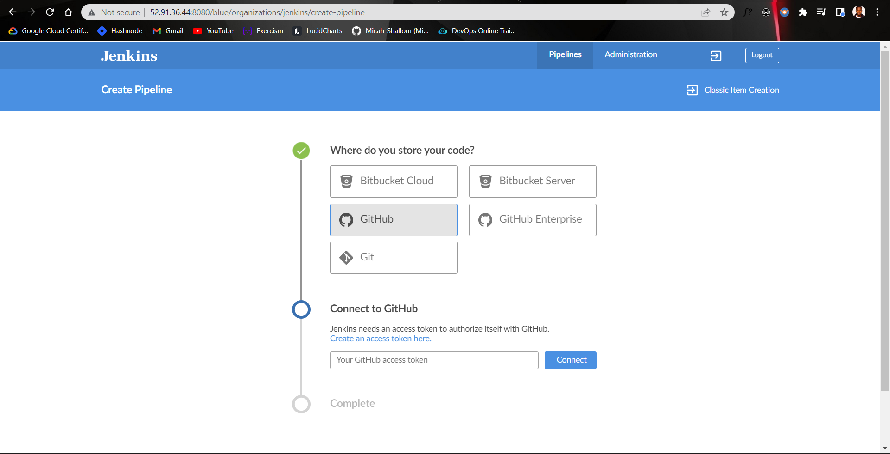
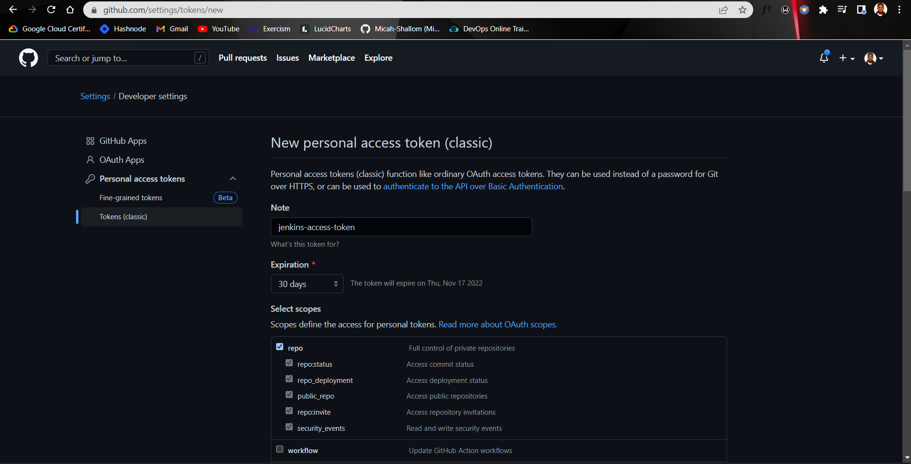
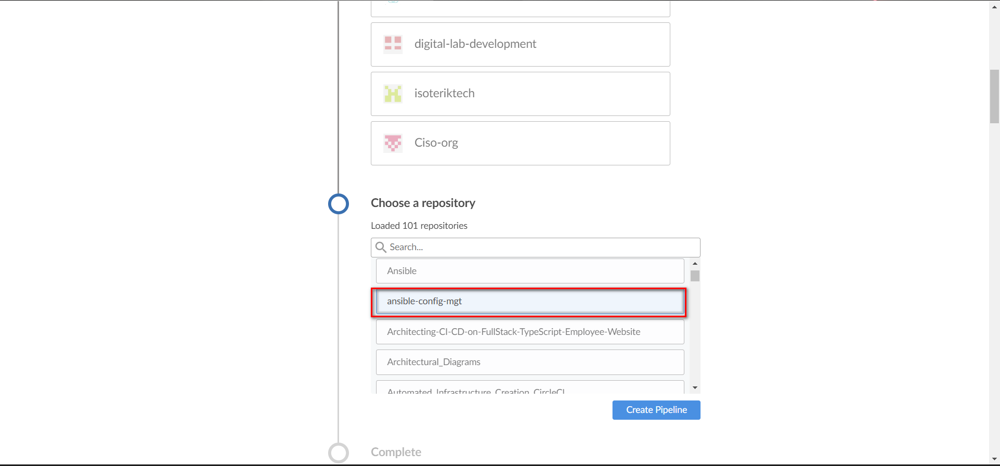
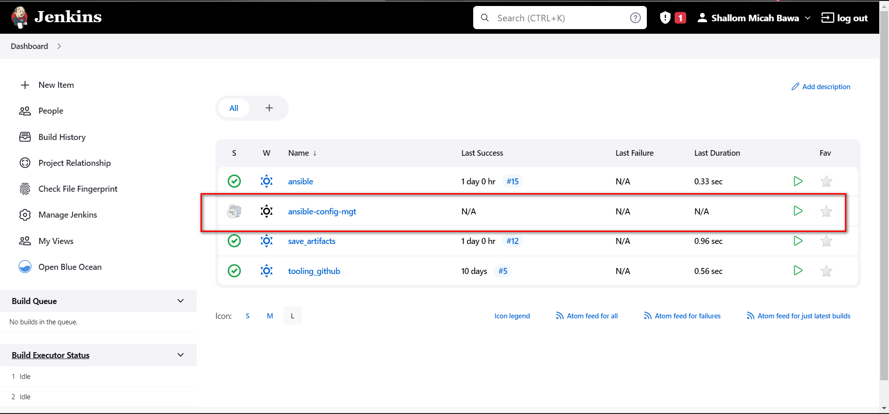

# CI/CD PIPELINE FOR A PHP BASED APPLICATION



## Project Description:

In this project, I will be setting up a CI/CD Pipeline for a PHP based application. The overall CI/CD process looks like the architecture above.

This project is architected in two major repositories with each repository containing its own CI/CD pipeline written in a Jenkinsfile
- **NEW-ANSIBLE repository contains JenkinsFile which is responsible for setting up and configuring infrastructure required to carry out processes required for our application to run. It does this through the use of ansible roles. **<u>This repo is infrastructure specific</u>**
- **PHP-todo REPO** : this repository contains jenkinsfile which is focused on processes which are <u>**application build specific**</u> such as building, linting, static code analysis, push to artifact repository etc

## Prerequisites

Will be making use of AWS virtual machines for this and will require 6 servers for the project which includes:
**Nginx Server**: This would act as the reverse proxy server to our site and tool. <br/>

**Jenkins server**: To be used to implement your CI/CD workflows or pipelines. Select a t2.medium at least, Ubuntu 20.04 and Security group should be open to port 8080 <br/>

**SonarQube server**: To be used for Code quality analysis. Select a t2.medium at least, Ubuntu 20.04 and Security group should be open to port 9000 <br/>

**Artifactory server**: To be used as the binary repository where the outcome of your build process is stored. Select a t2.medium at least and Security group should be open to port 8081 <br/>

**Database server**: To server as the databse server for the Todo application <br/>

**Todo webserver**: To host the Todo web application. <br/>
#

## Environments
Ansible Inventory should look like this

```
├── ci
├── dev
├── pentest
├── pre-prod
├── prod
├── sit
└── uat
```
#

## ANSIBLE ROLES FOR CI ENVIRONMENT
To automate the setup of `SonarQube` and `JFROG Artifactory`, we can use `ansible-galaxy` to install this configuration into our ansible roles which will be used and run against the `sonarqube server and artifactory server`.

We will see this in play later
#

## Configuring Ansible For Jenkins Deployment
#

We create a Jenkins-server with a t2.medium specification because we will be needing more compute power to run builds compared to the jenkins-server we have been using in project 13

### Prepare your Jenkins server
Connect to your Jenkins instance on VScod via SSH and set up SSH-agent to ensure ansible get the private jey required to connect to all other servers:

```
eval `ssh-agent -s`
ssh-add <path-to-private-key>
```

### Install the following packages and dependencies on the server:
- Install git : sudo apt install git 

- Clone down the Asible-config-mgt repository: git clone https://github.com/Micah-Shallom/ansible-config-mgt.git

- Install Jenkins and its dependencies. Steps to install Jenkins can be found here
 
- Configure Ansible For Jenkins Deployment. 
- Navigate to Jenkins URL: <Jenkins-server-public-IP>:8080

In the Jenkins dashboard, click on Manage Jenkins -> Manage plugins and search for Blue Ocean plugin. Install and open Blue Ocean plugin.



- Get personal access token from github
 




- This job gets created automatically by blue-ocean after connection with github repo.
  

#
